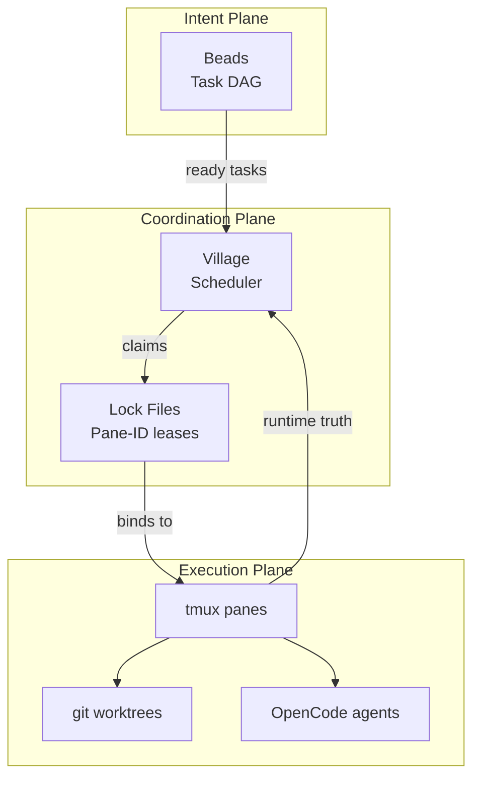

# Village


**A tiny operating system for parallel development.**

Village orchestrates multiple AI agents working in parallel — safely, locally, and transparently — using tools you already trust:

- **Beads** for task readiness and dependencies  
- **tmux** for runtime truth and observability  
- **git worktrees** for isolation  
- **OpenCode** for execution  
- **ppc** (optional) for deterministic contracts  

No daemon.  
No database.  
No hidden state.

---

## Why Village?

Modern development has a coordination problem.

We can run multiple AI agents — but we can’t reliably coordinate them.

Most systems fail in one of three ways:

### ❌ Too much magic
Background services, opaque schedulers, hidden state.

### ❌ Too much ceremony
YAML pipelines, workflow DSLs, configuration graphs.

### ❌ No recovery model
When terminals close or machines reboot, work is duplicated or lost.

---

### Village takes a different approach

Village treats your local machine like a **tiny operating system**:

- **Beads** decides *what work is ready*
- **Village** decides *who should work on it*
- **tmux panes** prove *what is actually running*

If the pane exists → the work exists.  
If it doesn’t → it doesn’t.

No guessing.

---

## Architecture



---

## Quickstart (60 seconds)

```bash
village up
village ready
village queue --n 3
```

Inspect anytime:

```bash
village status --workers
village resume
```

---

## Philosophy

Village is intentionally boring.

It does not hide execution.  
It does not predict intent.  
It does not require belief.

It simply coordinates reality.

---

## Development

### Installation

```bash
uv sync
uv pip install -e .
```

### Testing

Run unit tests (fast, no external dependencies):
```bash
pytest -m "not integration"
```

Run integration tests (requires tmux/beads):
```bash
pytest -m integration
```

Run all tests (unit + integration):
```bash
pytest
```

Run tests with coverage:
```bash
pytest --cov=village
```

### Linting

```bash
uv run ruff check .
uv run ruff format .
```

### Type Checking

```bash
uv run mypy village/
```

### Probes

Village probes inspect runtime state without mutations:

- **tmux**: Session and pane queries (cached, 5s TTL)
- **beads**: Beads command availability and initialization
- **repo**: Git repository root detection

#### Caching

Tmux pane queries use per-session caching:
- Cache cleared on CLI entry
- 5s TTL for automatic refresh
- Use `refresh_panes(session_name)` after tmux mutations

#### Test Commands

```bash
# Unit tests only (fast)
pytest -m "not integration"

# Integration tests only (requires tmux/beads)
pytest -m integration

# All tests (unit + integration)
pytest

# Verbose output
pytest -v

# Show test execution time
pytest --durations=10

# With coverage
pytest --cov=village --cov-report=html
```
