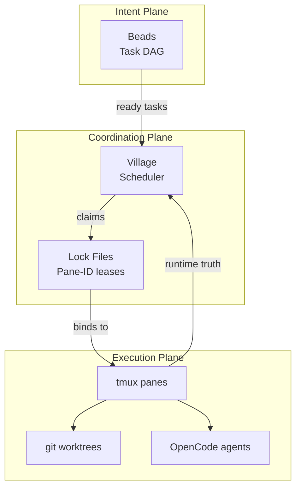

# Village


**A tiny operating system for parallel development.**

Village orchestrates multiple AI agents working in parallel — safely, locally, and transparently — using tools you already trust:

- **Beads** for task readiness and dependencies
- **tmux** for runtime truth and observability
- **git worktrees** for isolation
- **OpenCode** for execution
- **ppc** (optional) for deterministic contracts

No daemon.
No database.
No hidden state.

---

## Why Village?

Modern development has a coordination problem.

We can run multiple AI agents — but we can't reliably coordinate them.

Most systems fail in one of three ways:

### ❌ Too much magic
Background services, opaque schedulers, hidden state.

### ❌ Too much ceremony
YAML pipelines, workflow DSLs, configuration graphs.

### ❌ No recovery model
When terminals close or machines reboot, work is duplicated or lost.

---

### Village takes a different approach

Village treats your local machine like a **tiny operating system**:

- **Beads** decides *what work is ready*
- **Village** decides *who should work on it*
- **tmux panes** prove *what is actually running*

If the pane exists → work exists.
If it doesn't → it doesn't.

No guessing.

---

## Architecture



---

## Quickstart (60 seconds)

```bash
village up
village ready
village queue --n 3
```

Inspect anytime:

```bash
village status --workers
village resume
```

---

## Philosophy

Village is intentionally boring.

It does not hide execution.
It does not predict intent.
It does not require belief.

It simply coordinates reality.

---

## Configuration

### Environment Variables

| Variable | Description | Default |
|----------|-------------|---------|
| `VILLAGE_DIR` | Village directory path | `.village/` |
| `VILLAGE_WORKTREES_DIR` | Worktrees directory | `.worktrees/` |
| `VILLAGE_MAX_WORKERS` | Max parallel workers | 2 |
| `VILLAGE_DEFAULT_AGENT` | Default agent name | `worker` |
| `VILLAGE_SCM` | SCM backend (Git or Jujutsu) | `git` |

**Example:**
```bash
export VILLAGE_MAX_WORKERS=4
export VILLAGE_SCM=git
village queue --n 2
```

### Config File (.village/config)

Village uses an INI-style config file for agent configuration:

```ini
[DEFAULT]
DEFAULT_AGENT=worker
SCM=git

[agent.build]
opencode_args=--mode patch --safe
contract=contracts/build.md
ppc_mode=build
ppc_traits=conservative,terse
ppc_format=markdown

[agent.frontend]
opencode_args=--mode patch
contract=contracts/frontend.md
ppc_mode=explore
ppc_traits=verbose
ppc_format=markdown
```

To use Jujutsu (jj) instead of Git:

```ini
[DEFAULT]
DEFAULT_AGENT=worker
SCM=jj

[agent.build]
# ... rest of config
```

### PPC Integration (Optional)

If `ppc` is installed, Village can generate contracts automatically:

```ini
[agent.build]
ppc_mode=build
ppc_traits=conservative,terse
ppc_format=markdown
```

**Priority order:**
1. Custom contract file (if specified)
2. PPC-generated prompt (if available)
3. Fallback Markdown template

If PPC is unavailable, Village falls back to Markdown templates.

---

## Version History

### v1.3 - Jujutsu (jj) Support (Released)

Jujutsu (jj) backend implementation, leveraging the SCM abstraction from v1.1.

**What's Included:**
- New `village/scm/jj.py` backend implementing the SCM Protocol
- Opt-in support via `SCM=jj` in config or environment variable
- Village workspaces use `.worktrees/bd-a3f8/` pattern (same as Git backend)
- Identical Village commands for both Git and jj backends
- No migration required for existing Git users

**Configuration:**
```bash
# Default (Git)
village queue

# Use Jujutsu backend
SCM=jj village queue
# or in .village/config:
# [DEFAULT]
# SCM=jj
```

**Benefits:**
- Validates SCM abstraction design from v1.1
- Provides early value for jj users without waiting for v2
- Git backend remains default and fully supported
- Zero core logic changes (pure SCM backend addition)

**Implementation Details:**
- JJSCM kind attribute returns "jj"
- All SCM protocol methods implemented: `ensure_repo`, `check_clean`, `ensure_workspace`, `remove_workspace`, `list_workspaces`
- Workspace management follows Village's `.worktrees/bd-a3f8/` pattern
- Configuration validation ensures only valid SCM kinds ("git" or "jj")
- Error handling fails fast if `jj` binary not found

**Timeline:** Estimated 8-12 hours over 2-3 days

---

### v1.2 - Reliability & Observability

Event logging, queue deduplication, and enhanced cleanup for production reliability.

**Event Logging:**
- Automatic audit trail in `.village/events.log` (NDJSON)
- All operations logged with timestamps, task IDs, and results
- Use for crash recovery, debugging, and audit

**Queue Deduplication:**
- Prevents tasks from running twice within configurable TTL (default: 5 min)
- Override with `village queue --force`
- Configure via `QUEUE_TTL_MINUTES` or `VILLAGE_QUEUE_TTL_MINUTES` env var

**Cleanup Enhancements:**
- `village cleanup --apply` removes orphan and stale worktrees
- Safer corrupted lock handling with automatic logging

**JSON Output:**
- `--plan --json` now includes lock details and workspace paths
- Full task metadata for dry-run validation

```bash
# View recent events
cat .village/events.log | jq .

# Plan queue (skips recent executions)
village queue --plan --json

# Cleanup with worktree removal
village cleanup --plan --apply
```

---

### v1.1 - SCM Abstraction Edition

Village now uses a pluggable SCM (Source Control Management) layer for workspace operations.

**Current Support (v1.1):**
- Git backend (default, fully functional)
- All existing Village commands work identically

**Upcoming (v1.3):**
- Jujutsu (jj) backend support
- Zero core logic changes required
- Enable `SCM=jj` in configuration

**Configuration:**
```bash
# Default (Git)
village queue

# Use Jujutsu backend (v1.3)
SCM=jj village queue
```

**Benefits:**
- Core Village logic remains SCM-agnostic
- Enables jj backend without refactoring
- Supports custom SCM backends (e.g., Mercurial, Bazaar)
- Isolates all Git-specific commands to `village/scm/git.py`

See [docs/ROADMAP.md](docs/ROADMAP.md) for complete implementation details.

---

## Exit Codes

| Code | Meaning | Example |
|-------|----------|---------|
| 0 | Success | `village resume bd-a3f8` completes |
| 1 | Generic error | Worktree creation failed |
| 2 | Not ready / precondition failed | `village queue` when no tasks ready |
| 3 | Blocked / no work available | `village queue` with no ready tasks |
| 4 | Partial success | `village queue` with some tasks failed |
| 5 | Invalid usage | Missing required arguments |

Exit codes are simple (0-5) for easy scripting:

```bash
village queue --n 3
case $? in
    0) echo "All started" ;;
    4) echo "Partial success, some failed" ;;
    *) echo "Failed" ;;
esac
```

---

## Commands Reference

### village up

Initialize village runtime (idempotent).

```bash
village up
```

**What it does:**
- Starts tmux session if not running
- Creates `.village/` directory structure
- Initializes Beads if available

### village ready

Check if village is ready for work.

```bash
village ready
```

**What it checks:**
- Git repository exists
- Runtime (tmux session) is initialized
- Beads is available (optional)

### village status

Show village status.

```bash
village status --workers    # Workers table
village status --orphans    # Orphan detection
village status --locks      # Locks view
village status --short     # Minimal status
village status --json      # JSON output
```

**Output options:**
- `--workers`: Tabular workers view (TASK_ID, STATUS, PANE, AGENT, WINDOW)
- `--orphans`: Orphaned resources with suggested actions
- `--locks`: All locks with ACTIVE/STALE status
- `--short`: Minimal status (tmux + locks count)
- `--json`: Full status as JSON

### village resume

Resume a task (explicit or planner).

```bash
village resume bd-a3f8              # Explicit resume
village resume --agent build          # Use specific agent
village resume bd-a3f8 --detached  # Detached mode
village resume                          # Use planner
village resume bd-a3f8 --html      # HTML output
```

**Planner mode** (no task ID):
- Suggests next action based on runtime state
- Actions: `up`, `status`, `cleanup`, `queue`, `ready`

**Options:**
- `--agent <name>`: Use specific agent
- `--detached`: Run without attaching to tmux pane
- `--html`: Output HTML with embedded JSON metadata
- `--dry-run`: Preview mode (no mutations)

### village queue

Queue and execute ready tasks from Beads.

```bash
village queue --n 3           # Start 3 tasks
village queue --agent frontend  # Only frontend tasks
village queue --dry-run        # Preview mode
village queue --json          # JSON output
```

**Options:**
- `--n <count>`: Maximum tasks to start
- `--agent <name>`: Only queue tasks for specific agent
- `--dry-run`: Preview mode (show plan without executing)
- `--json`: JSON output

### village cleanup

Remove stale locks and untracked worktrees.

```bash
village cleanup           # Plan mode (dry-run)
village cleanup --apply    # Execute cleanup
village cleanup --apply --force  # Include corrupted locks
```

**What it removes:**
- Stale locks (panes that no longer exist)
- Untracked worktrees (no corresponding lock)
- (Optional with `--force`): Corrupted lock files

### village down

Stop village runtime.

```bash
village down
```

**What it does:**
- Kills tmux session
- Leaves worktrees and locks intact (use `cleanup` to remove)

### village unlock

Unlock a task (remove lock file).

```bash
village unlock bd-a3f8          # Remove lock file
village unlock bd-a3f8 --force   # Force remove (if corrupted)
```

### village locks

List all locks with ACTIVE/STALE status.

```bash
village locks
```

**Output format:**
```
TASK_ID    STATUS    PANE     AGENT     WINDOW
bd-a3f8    ACTIVE    %12      worker    worker-1-bd-a3f8
bd-b7c2    STALE     %13      worker    worker-2-bd-b7c2
```

---

## Examples

For practical examples and workflows, see [docs/examples/](docs/examples/):

- [First Task Ever](docs/examples/01-quickstart/first-task.md) - Basic workflow
- [Custom Agent](docs/examples/02-configuration/custom-agent.md) - Define specialized agents
- [Queue Multiple](docs/examples/03-commands/queue-multiple.md) - Queue across agent types
- [Multiple Agents](docs/examples/04-configuration/multiple-agents.md) - 3+ specialized agents
- [Multi-Day Workflow](docs/examples/05-advanced/workflow.md) - Interrupts, stale locks, corrupted locks

---

## Troubleshooting

### "not in a git repository"

Village must run inside a Git repository.

**Fix:**
```bash
cd /path/to/your/repo
git init  # if not initialized
village up
```

### "no tmux session found"

Village requires tmux runtime.

**Fix:**
```bash
village up  # Starts tmux session
```

### "bd command not available"

Beads is optional. Village works without it, but `village queue` requires it.

**Fix:**
```bash
# Option 1: Install Beads
cargo install beads

# Option 2: Use explicit resume
village resume bd-a3f8
```

### Stale locks remain after interrupt

If `village resume` is interrupted (Ctrl+C), resources remain.

**Fix:**
```bash
# Inspect what's orphaned
village status --orphans

# Clean up
village cleanup --apply
```

### Corrupted lock files

If lock files are corrupted, they appear in status.

**Fix:**
```bash
# View all locks
village status --locks

# Manually remove corrupted lock
village unlock <task-id> --force

# Or cleanup with --force
village cleanup --apply --force
```

### No color output

Colors auto-disable for:
- Piped output (`village status | less`)
- `--json` flag
- Non-TTY terminals

**Note:** Colors use Click's auto-detection, no manual enable needed.

```bash
village status  # Colors on TTY
village status | cat  # Plain text (no colors)
```

### "Permission denied" errors

Village needs write access to `.village/` directory.

**Fix:**
```bash
# Check directory permissions
ls -la .village/

# Ensure write access
chmod u+w .village/ .village/locks/

# Or use sudo (not recommended)
sudo village up
```

### Workers not starting

If `village queue` starts tasks but workers don't appear in status.

**Fix:**
```bash
# Check if tmux session exists
tmux list-sessions

# Check for panes
tmux list-panes -t village

# Check OpenCode is available
which opencode

# Run with verbose logging
village --verbose queue --n 1
```

### "Config file not found"

Village can run without config file, uses defaults.

**Fix:**
```bash
# Create minimal config
mkdir -p .village
cat > .village/config <<EOF
[DEFAULT]
DEFAULT_AGENT=worker
EOF
```

---

## Shell Completion

Bash and zsh completion are supported via Click 8.1+. See [docs/SHELL_COMPLETION.md](docs/SHELL_COMPLETION.md) for setup instructions.

**Quick setup:**

**Bash:**
```bash
eval "$(_VILLAGE_COMPLETE=bash_source village)"
```

**Zsh:**
```zsh
eval "$(_VILLAGE_COMPLETE=zsh_source village)"
```

---

## Development

### Installation

```bash
uv sync
uv pip install -e .
```

### Testing

Run unit tests (fast, no external dependencies):
```bash
pytest -m "not integration"
```

Run integration tests (requires tmux/beads):
```bash
pytest -m integration
```

Run all tests (unit + integration):
```bash
pytest
```

Run tests with coverage:
```bash
pytest --cov=village
```

### Linting

```bash
uv run ruff check .
uv run ruff format .
```

### Type Checking

```bash
uv run mypy village/
```

### Probes

Village probes inspect runtime state without mutations:

- **tmux**: Session and pane queries (cached, 5s TTL)
- **beads**: Beads command availability and initialization
- **repo**: Git repository root detection

#### Caching

Tmux pane queries use per-session caching:
- Cache cleared on CLI entry
- 5s TTL for automatic refresh
- Use `refresh_panes(session_name)` after tmux mutations

#### Test Commands

```bash
# Unit tests only (fast)
pytest -m "not integration"

# Integration tests only (requires tmux/beads)
pytest -m integration

# All tests (unit + integration)
pytest

# Verbose output
pytest -v

# Show test execution time
pytest --durations=10

# With coverage
pytest --cov=village --cov-report=html
```

---

## Contributing

Village is intentionally small and opinionated.

See [AGENTS.md](AGENTS.md) for development guidelines.

---

## License

MIT

---

## See Also

- [AGENTS.md](AGENTS.md) - Agent development guide
- [docs/PRD.md](docs/PRD.md) - Product requirements document
- [docs/ROADMAP.md](docs/ROADMAP.md) - Implementation roadmap and future versions
- [docs/PROPOSALS.md](docs/PROPOSALS.md) - Optional extensions and proposals
- [docs/examples/](docs/examples/) - Practical examples
- [docs/SHELL_COMPLETION.md](docs/SHELL_COMPLETION.md) - Shell setup
