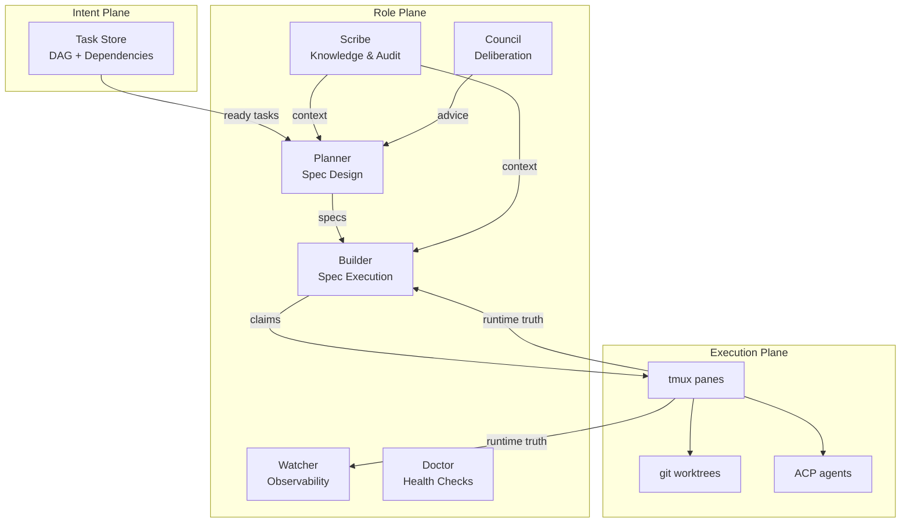

# Village


**A tiny operating system for parallel development.**

Village orchestrates multiple AI agents working in parallel using tools you already
trust: tmux, git, and a file-based task store. It provides role-based specialists for
planning, building, knowledge management, and deliberation, coordinated through a
spec-driven autonomous build loop. No daemon, no database, no hidden state.

---

## Why Village?

We can run multiple AI agents, but we can't reliably coordinate them. Most systems
fail in one of three ways:

- **Too much magic** — background services, opaque schedulers, hidden state.
- **Too much ceremony** — YAML pipelines, workflow DSLs, configuration graphs.
- **No recovery model** — when terminals close or machines reboot, work is lost.

Village treats your local machine like an operating system:

- **Task store** decides what work is ready
- **Village** decides who should work on it
- **tmux panes** prove what is actually running

If the pane exists, work exists. If it doesn't, it doesn't.

---

## 5-Minute Demo

From nothing to parallel agents running on a fresh machine.

### Install

```bash
pip install village-ai
# or: uvx village
```

Requires: Python 3.11+, git, tmux.

### Create a project

```bash
mkdir my-app && cd my-app && git init
village up
```

`village up` creates `.village/`, a tmux session, and a default config. It is idempotent and safe to re-run.

### Define work

```bash
village tasks create "Add a CLI entry point with --help"
village tasks create "Add pytest and a smoke test"
village tasks create "Add .gitignore for Python"
village tasks create "Add README with install instructions"
```

Dependencies? Add `--depends-on <id>` to make tasks wait for each other.

### Plan

```bash
village planner design "Bootstrap a Python CLI project"
```

The planner interacts with an LLM to decompose your goal into numbered specs in `specs/`. Each spec has acceptance criteria and a completion signal.

```bash
village planner inspect     # Review specs for cross-cutting issues
village planner inspect --fix  # Review and amend
```

### Build

```bash
village builder run         # Sequential: one spec at a time
village builder run -p 3    # Parallel: 3 agents in 3 worktrees
```

The builder loops through specs. For each one, it spawns an AI agent in an isolated
git worktree inside a tmux pane. The agent reads the spec, implements code, runs tests,
and outputs `<promise>DONE</promise>` when all acceptance criteria pass. On failure,
Village rolls back the worktree and marks the spec for retry.

### Watch

```bash
village watcher status --system    # What's running right now
village watcher dashboard --watch  # Live refresh every 2s
village watcher events             # Recent event log
```

If your terminal crashes or you reboot:

```bash
village watcher status --system    # Shows stale locks and orphans
village watcher cleanup --apply    # Cleans them up
village builder run                 # Picks up where it left off
```

### Ship

```bash
village tasks update <id> --status done  # Mark tasks complete
village builder arrange --dry-run        # Preview version bump + changelog
village builder arrange                  # Apply and tag
```

That's the full loop: no daemon, no database, no hidden state.

---

## Village vs Manual Coordination

| | **Manual** | **With Village** |
|---|---|---|
| **Start work** | Open 3 terminals, pick tasks by feel | `village builder run -p 3` |
| **Avoid conflicts** | Slack: "anyone editing auth.py?" | Lock system + conflict detection |
| **Know what's running** | Check each terminal manually | `village watcher status --system` |
| **Recover from crash** | Guess which tasks were running | `village watcher cleanup --apply` |
| **Track state** | Post-it notes, spreadsheets | Event log, lock files, state machine |
| **Release** | Manual version bump, copy-paste changelog | `village builder arrange` |
| **Scale to N agents** | Open N more terminals | `village builder run -p N` |

---

## Features

### Role-Based Specialists

| Role | Default Chat | Subcommands |
|------|-------------|-------------|
| **planner** | "What do you want to accomplish?" | `workflows`, `show`, `design`, `refine`, `inspect` |
| **builder** | "Which specs shall I work on?" | `run`, `status`, `cancel`, `logs`, `resume`, `queue`, `pause`, `arrange` |
| **watcher** | "What would you like to observe?" | `status`, `locks`, `events`, `dashboard`, `cleanup`, `unlock`, `monitor`, `ledger show`, `ledger list`, `ready` |
| **scribe** | "What do you want to know?" | `fetch`, `ask`, `curate`, `drafts` |
| **council** | "What shall we discuss?" | `debate`, `list`, `show` |
| **doctor** | "What seems to be the problem?" | `diagnose`, `prescribe` |
| **greeter** | "How can I help?" | General triage, routes to all roles |

Each role has its own greeting, skills, and cross-routing rules. Roles hand off to each other via `ROUTE:` and `ADVISE:` markers.

### Spec-Driven Build Loop

The builder implements specs autonomously via the Ralph Wiggum methodology:

```bash
village planner design <goal>          # LLM pipeline → produces spec in specs/
village planner inspect                # Review all specs (read-only)
village planner inspect --fix          # Review + amend specs
village planner refine <spec-id>       # Iterate on a spec

village builder run                    # Loop through specs (sequential)
village builder run -p 4               # Parallel mode, 4 worktrees
village builder run -n 20              # Max 20 iterations
village builder run --dry-run          # Preview without executing
village builder status                 # Show spec completion progress
```

### Scribe Knowledge Base

```bash
village scribe fetch <url|file>         # Ingest knowledge source
village scribe ask "question"           # Query knowledge base
village scribe curate                   # Health check + regenerate VOICE.md
village scribe drafts                   # List or count draft tasks
```

Sources are auto-tagged, cross-linked, and stored as markdown with YAML frontmatter. The curated knowledge distills into `VOICE.md` for agent context.

### Council Deliberation

Multi-persona debate with transcript recording:

```bash
village council debate <topic>         # Start a deliberation
village council list                   # Past councils
village council show <id>              # View transcript
village council debate --from <id> --rematch  # Re-run with same config
```

### Adaptive Onboarding

```bash
village new <name>                     # Create project with adaptive interview
village up                             # Detects incomplete setup, runs interview
village up --force                     # Overwrite existing files
```

The onboarding pipeline detects your project type, runs an LLM-driven adaptive interview (10-15 questions), and generates `AGENTS.md` + `README.md` + wiki seeds. Use `village up --skip-onboard` to skip the interview.

### ACP Integration

Village supports the **Agent Client Protocol (ACP)** for editor integration and external agents:

```bash
# Server mode (for editors like Zed, JetBrains)
village acp

# Client mode (orchestrate external agents)
village acp --list-agents
village acp --test claude
```

### Workflow Engine

YAML-based workflow definitions with LLM-driven planning:

```bash
village planner workflows             # List available workflows
village planner show decomposer       # Show workflow steps
village planner design <goal>         # Design a new workflow via LLM
village planner refine <goal>         # Refine an existing workflow
```

Step types: `prompt`, `critique`, `decompose`, `research`, `synthesize`.

### Core Infrastructure

- **Multi-agent coordination** — Lock system prevents duplicate work, concurrency limits enforce fairness
- **State management** — Lock files survive crashes, event logs capture audit trails, orphan detection cleans up failures
- **Observability** — Real-time dashboard, event queries, wiki monitoring
- **Safety guarantees** — Conflict detection, automatic rollback, resource quotas
- **Doctor framework** — Built-in health checks for git, quality, and tests; extensible with custom analyzers
- **Release automation** — `village builder arrange`: semver bumps from task metadata, categorized changelogs, git tags
- **Native task store** — File-based task management with dependencies, search, and atomic operations
- **File-based memory** — Markdown memory store with find/recent/related search
- **Extensibility** — 7 extension points for domain customization without forking

---

## Architecture


```mermaid
flowchart TB
    subgraph Intent["Intent Plane"]
        TS[Task Store<br/>DAG + Dependencies]
    end

    subgraph Roles["Role Plane"]
        P[Planner<br/>Spec Design]
        B[Builder<br/>Spec Execution]
        W[Watcher<br/>Observability]
        E[Scribe<br/>Knowledge & Audit]
        C[Council<br/>Deliberation]
        D[Doctor<br/>Health Checks]
    end

    subgraph Execution["Execution Plane"]
        TMUX[tmux panes]
        WT[git worktrees]
        ACP[ACP agents]
    end

    TS -->|ready tasks| P
    P -->|specs| B
    B -->|claims| TMUX
    TMUX --> WT
    TMUX --> ACP
    E -->|context| P
    E -->|context| B
    C -->|advice| P
    TMUX -->|runtime truth| B
    TMUX -->|runtime truth| W
```

---

## Quickstart (60 seconds)

```bash
village up                              # Initialize runtime
village new my-project                   # Create project with onboarding
village planner design "Add auth"        # Design a spec
village builder run                      # Implement specs autonomously
```

Task management:

```bash
village tasks list                       # List tasks
village tasks create "Fix login bug"     # Create a task
village tasks ready                      # Show ready tasks
village builder queue --n 3              # Start 3 tasks
village watcher status --system          # Show active workers
```

Inspect anytime:

```bash
village doctor diagnose                  # Run health checks
village scribe curate                    # Maintain knowledge base
village watcher ledger show bd-xyz       # View audit trail
village builder arrange --dry-run        # Preview release
```

---

## Commands Reference

### Core Operations

| Command | Description |
|---------|-------------|
| `village up` | Initialize Village runtime (idempotent, `--json`) |
| `village down` | Stop Village runtime (kill tmux session, `--json`) |
| `village new <name>` | Create project with adaptive onboarding (`--json`) |

### Watcher (Observability)

| Command | Description |
|---------|-------------|
| `village watcher status` | Show Village status (`--system`, `--task`, `--wiki`, `--short`, `--json`) |
| `village watcher locks` | Show all locks (`--json`) |
| `village watcher events` | Show recent events (`--task`, `--cmd`, `--limit`, `--json`) |
| `village watcher ready` | Check if Village is ready for work (`--json`) |
| `village watcher dashboard` | Real-time dashboard (`--watch`, `--refresh-interval`) |
| `village watcher cleanup` | Remove stale locks/worktrees (`--apply`, `--plan`, `--json`) |
| `village watcher unlock <task-id>` | Remove a lock (`--force`, `--json`) |
| `village watcher monitor` | Watch wiki/ingest/ for new files |
| `village watcher ledger show [task]` | View audit trail for a task (`--json`) |
| `village watcher ledger list` | List tasks with traces (`--json`) |

### Task Management

| Command | Description |
|---------|-------------|
| `village tasks list` | List tasks (`--status`, `--type`, `--label`, `--limit`, `--json`) |
| `village tasks show <id>` | Show task details (`--json`) |
| `village tasks create <title>` | Create a task (`-d`, `--type`, `-p`, `-l`, `--depends-on`, `--blocks`) |
| `village tasks ready` | Show ready tasks (`--json`) |
| `village tasks update <id>` | Update a task (`--status`, `-l`, `-p`, `-d`, `--title`) |
| `village tasks search <query>` | Search tasks by keyword |

### Planning & Building

| Command | Description |
|---------|-------------|
| `village planner design <goal>` | Design a spec via LLM pipeline |
| `village planner inspect [spec]` | Review specs for cross-cutting issues (`--fix`) |
| `village planner refine <spec>` | Iterate on a spec |
| `village planner workflows` | List available workflow templates (`--json`) |
| `village planner show [name]` | Display workflow steps (`--json`) |
| `village planner list` | List plans (`--drafts`, `--completed`, `--json`) |
| `village planner plan <slug>` | Show plan details (`--json`) |
| `village planner approve <slug>` | Approve a plan (`--json`) |
| `village planner delete <slug>` | Delete a plan (`--force`, `--json`) |
| `village builder run` | Run autonomous spec-driven build loop |
| `village builder status` | Show build loop status (`--json`) |
| `village builder queue` | Queue and execute ready tasks (`--json`) |
| `village builder arrange` | Arrange done tasks into stacked PRs (`--dry-run`, `--json`) |
| `village builder resume --build` | Resume a stopped build loop |
| `village builder pause` | Pause an in-progress task |

### Scribe (Knowledge Base)

| Command | Description |
|---------|-------------|
| `village scribe fetch <source>` | Ingest a URL or file into wiki (`--json`) |
| `village scribe ask "question"` | Query the knowledge base (`--json`) |
| `village scribe curate` | Health check + regenerate VOICE.md (`--json`) |
| `village scribe drafts` | List or count draft tasks (`--json`) |

### Council (Deliberation)

Start a deliberation session with `village council` (no subcommand) or use subcommands:

| Command | Description |
|---------|-------------|
| `village council` | Start a deliberation session (RoleChat) |
| `village council debate <topic>` | Start a deliberation |
| `village council debate --from <id> --rematch` | Re-run with same configuration (`--json`) |
| `village council list` | List past councils (`--type`, `--json`) |
| `village council show <id>` | View a council transcript (`--json`) |

### Other Commands

| Command | Description |
|---------|-------------|
| `village doctor diagnose` | Run project health diagnostics (`--json`) |
| `village doctor prescribe` | Show recommendations from diagnosis (`--fix`) |
| `village acp` | Run as ACP agent (for editor integration) |
| `village greeter` | Start ephemeral Q&A session |

---

## Configuration

### Environment Variables

| Variable | Description | Default |
|----------|-------------|---------|
| `VILLAGE_DIR` | Village directory path | `.village/` |
| `VILLAGE_WORKTREES_DIR` | Worktrees directory | `.worktrees/` |
| `VILLAGE_MAX_WORKERS` | Max parallel workers | 2 |
| `VILLAGE_DEFAULT_AGENT` | Default agent name | `worker` |
| `VILLAGE_SCM` | SCM backend (git or jj) | `git` |

### Config File (.village/config)

Village uses an INI-style config file with sections for agents, LLM, safety, and more:

```ini
[DEFAULT]
DEFAULT_AGENT=worker
SCM=git

[onboard]
interview_model=openrouter/anthropic/claude-3-haiku
max_questions=15
critic_persona=red-team
self_critique=true

[agent.build]
opencode_args=--mode patch --safe
contract=contracts/build.md

[agent.claude]
type=acp
acp_command=claude-code
acp_capabilities=filesystem,terminal

[council]
default_type=chat
max_turns=10
resolution_strategy=synthesis
```

### ACP Editor Configuration

**Zed Editor** (`~/.config/zed/settings.json`):

```json
{
  "assistant": {
    "default_model": {
      "provider": "custom",
      "command": ["village", "acp"]
    }
  }
}
```

**JetBrains IDEs:** Install ACP plugin, configure custom agent command: `village acp`

---

## Spec Format

Specs are numbered markdown files in `specs/`:

```markdown
# 001-core-config

## Overview
Core configuration and CLI framework.

## Status: incomplete

## Requirements
- FR-1: Load config from INI files
  - [ ] Parses `.village/config` correctly
  - [ ] Falls back to defaults

## Completion Signal
Run `village doctor diagnose` and verify all pass.
<promise>DONE</promise>
```

- **Priority**: Lexicographic filename order (001, 002, ...)
- **Completion**: `Status: COMPLETE` written by the agent when done
- **Promise signal**: Agent outputs `<promise>DONE</promise>` when all criteria met
- **Inspect Notes**: Appended by `planner inspect --fix`, treated as hard constraints

---

## Release Automation

```bash
village builder arrange                  # Apply version bumps + changelog + tag
village builder arrange --dry-run        # Preview without making changes
```

Release process:

1. Check for unlabeled closed tasks (blocks release unless `--force`)
2. Aggregate bump labels from task store (`bump:major` > `bump:minor` > `bump:patch` > `bump:none`)
3. Compute next version from latest git tag (semver)
4. Update `CHANGELOG.md` with categorized entries (Breaking, Added, Changed, Fixed)
5. Create git tag `v{version}`
6. Clear bump queue and record release

Bump labels are applied per task: `village tasks label <task-id> add bump:<type>`

---

## Exit Codes

| Code | Meaning | Example |
|------|---------|---------|
| 0 | Success | `village builder resume --task village-t1` completes |
| 1 | Generic error | Worktree creation failed |
| 2 | Not ready / precondition failed | `village builder queue` when no tasks ready |
| 3 | Blocked / no work available | `village builder queue` with no ready tasks |
| 4 | Partial success | `village builder queue` with some tasks failed |
| 5 | Invalid usage | Missing required arguments |

---

## Philosophy

Village is intentionally boring. No hidden execution, no intent prediction, no belief
required. It coordinates what is actually running.

---

## Development

### Installation

```bash
uv sync
uv pip install -e .
```

### Testing

```bash
pytest -m "not integration"          # Unit tests only (fast)
pytest -m integration                 # Integration tests only
pytest                                # All tests
pytest --cov=village                  # With coverage
```

### Linting & Type Checking

```bash
uv run ruff check .                   # Lint
uv run ruff format .                  # Format
uv run mypy village/                  # Type check
```

---

## Troubleshooting

### "not in a git repository"

Village must run inside a Git repository.

```bash
cd /path/to/your/repo
git init  # if not initialized
village up
```

### "no tmux session found"

```bash
village up  # Starts tmux session
```

### Stale locks after interrupt

```bash
village watcher status --system   # Inspect what's orphaned
village watcher cleanup --apply   # Clean up
```

### Corrupted lock files

```bash
village watcher locks                  # View all locks
village watcher unlock <task-id> --force  # Force remove
village watcher cleanup --apply --force    # Clean up including corrupted
```

### Workers not starting

```bash
tmux list-sessions              # Check tmux
tmux list-panes -t village       # Check panes
which opencode                   # Check OpenCode
village --verbose builder queue --n 1    # Verbose logging
```

---

## Shell Completion

Bash and zsh completion supported via Click 8.1+:

**Bash:**
```bash
eval "$(_VILLAGE_COMPLETE=bash_source village)"
```

**Zsh:**
```zsh
eval "$(_VILLAGE_COMPLETE=zsh_source village)"
```

---

## Contributing

Village is intentionally small and opinionated. See [AGENTS.md](AGENTS.md) for development guidelines.

## License

MIT

---

## See Also

- [AGENTS.md](AGENTS.md) — Agent development guide
- [CHANGELOG.md](CHANGELOG.md) — Version history
- [docs/execution-engine.md](docs/execution-engine.md) — Policy enforcement for AI agents
- [docs/PRD.md](docs/PRD.md) — Product requirements document
- [docs/ROADMAP.md](docs/ROADMAP.md) — Implementation roadmap
- [docs/EXTENSIBILITY_GUIDE.md](docs/EXTENSIBILITY_GUIDE.md) — Extensibility guide
- [docs/EXTENSIBILITY_API.md](docs/EXTENSIBILITY_API.md) — Extensibility API reference
- [docs/SHELL_COMPLETION.md](docs/SHELL_COMPLETION.md) — Shell setup
- [docs/examples/](docs/examples/) — Practical examples